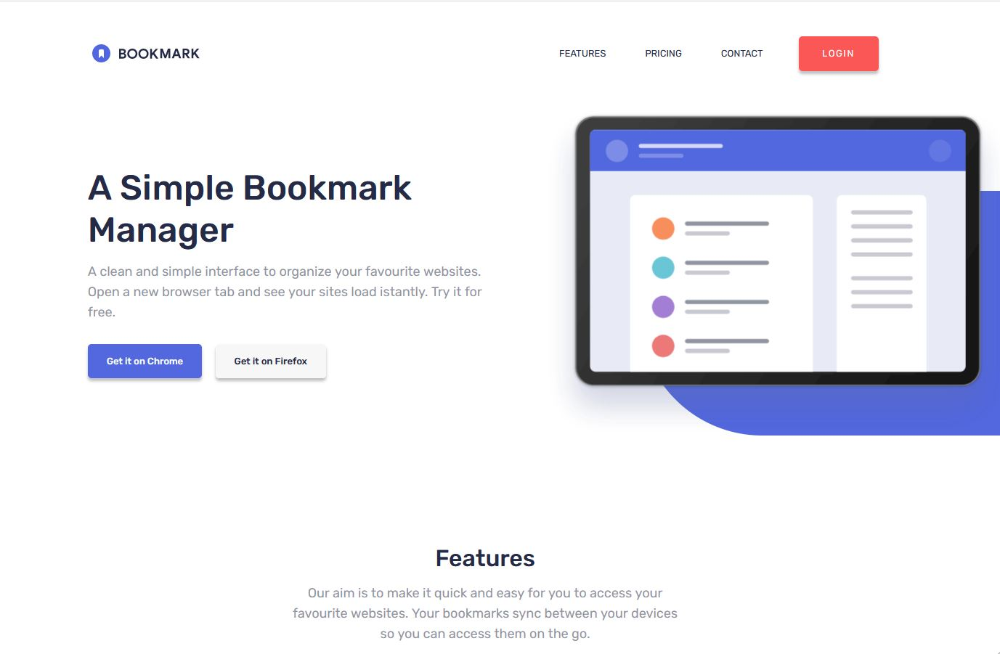

# Frontend Mentor - Bookmark landing page solution

This is a solution to the [Bookmark landing page challenge on Frontend Mentor](https://www.frontendmentor.io/challenges/bookmark-landing-page-5d0b588a9edda32581d29158). Frontend Mentor challenges help you improve your coding skills by building realistic projects.

## Table of contents

- [Overview](#overview)
  - [The challenge](#the-challenge)
  - [Screenshot](#screenshot)
  - [Links](#links)
- [My process](#my-process)
  - [Built with](#built-with)
  - [What I learned](#what-i-learned)
  - [Continued development](#continued-development)
- [Author](#author)

## Overview

### The challenge

Users should be able to:

- View the optimal layout for the site depending on their device's screen size
- See hover states for all interactive elements on the page
- Receive an error message when the newsletter form is submitted if:
  - The input field is empty
  - The email address is not formatted correctly

### Screenshot

### Links

- Solution URL: [ttps://www.frontendmentor.io/solutions/bookmark-page-built-with-bootstrap-parcel-sass-and-validatorjs-OH9JOy6BY](https://www.frontendmentor.io/solutions/bookmark-page-built-with-bootstrap-parcel-sass-and-validatorjs-OH9JOy6BY)
- Live Site URL: [https://bookmark-landing-page-dimolf345.netlify.app/](https://bookmark-landing-page-dimolf345.netlify.app/)

## My process

### Built with

- Semantic HTML5 markup
- Bootstrap customized
- Sass
- Parcel
- Flexbox
- CSS Grid
- Desktop-first workflow

### What I learned

With this project I tryed to customized Bootstrap Library, including the framework inside my Parcel bundler and then applying custom styles.
I learned also the basics of form validation, which in this project is done with the help of the [Validator.js library](https://www.npmjs.com/package/validator).
To built the HTML & CSS Markup, I tried to follow the steps detailed in the article [A step by step guide to turn design into code](https://css-tricks.com/a-step-by-step-process-for-turning-designs-into-code/)

### Continued development

This project Is almost competed with all the requirement of the challenges but It's far to be perfect. So maybe next month I will try to reopen again the code and see if the code is readable and understandable again.

I hope you will find my resources helpful for your projects too. ;)

## Author

- Frontend Mentor - [@dimolf345](https://www.frontendmentor.io/profile/dimolf345)
